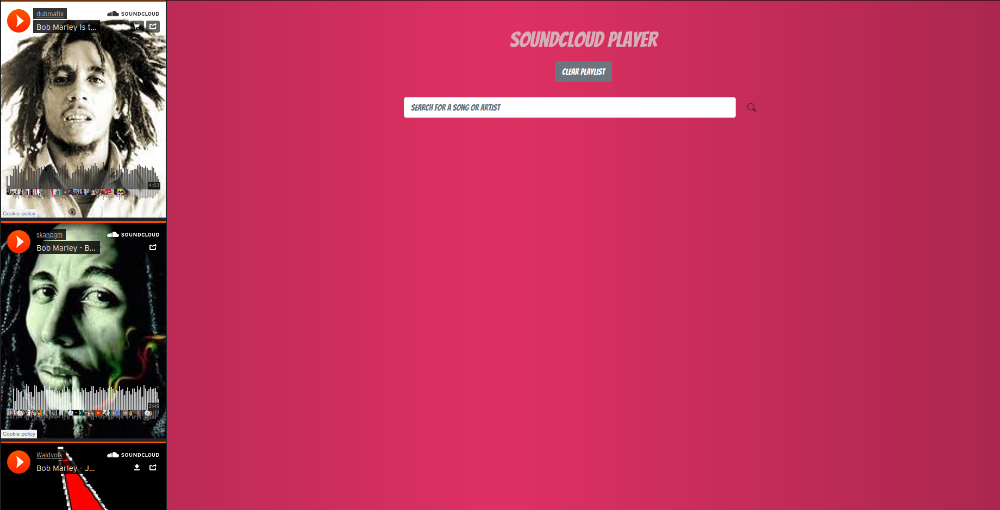

# Sound Cloud API Web Page

## Table of Contents
  <br />

* [About the Project](#about-the-project)
* [Built With](#built-with)
* [Contributing](#contributing)
* [Contact](#authors)
* [Acknowledgements](#acknowledgements) 
* [Getting Started](#getting-started) 
* [Live Demo and Video](#live-version) 

#
<br />

 <br/>
 <br/>
 <br/>
 <br/>


<br />

### Built With

* [JAVASCRIPT] [BOOTSTRAP] [WEBPACK] [BABEL] [API]

## Live Version

* [Live Demo](https://sergiocortessat.github.io/JSWeatherApp/) 

<!-- ABOUT THE PROJECT   -->
## About The Project
The SoundCloud API web page allows user to filter artist and obtain some of their most relevant music work. As well it enables you to add to your playlist and listening to the songs. It also allows users to dig further on music information by following the correspondent links within each song to find out more within the Sound Cloud webpage
## Screenshot Test

<p align="center">
  
</p>


## Contributing

Contributions make the open-source community such an amazing place to learn, inspire, and create. Any contributions you make are **greatly appreciated**.

## Prerequisites

Terminal or similar to execute the program.


## Getting Started


## Clone project

- To get a local copy up and running follow these simple example steps.
- Clone this repository with git clone ```https://github.com/sergiocortessat/JSWeatherApp``` using your terminal or command line.
- Change to the project directory by entering: ```cd JSWeatherApp``` in the terminal.


## Command line steps
```
- $ git clone `$ git clone https://github.com/sergiocortessat/JSWeatherApp
- $ git checkout develop
- $ cd JSWeatherApp
```

## Authors

👤 Sergio Cortes Satizabal

- Github: [@sergiocortessat](https://github.com/sergiocortessat)
- Twitter: [@sergiocortessat](https://twitter.com/sergiocortessat)
- LinkedIn: [@sergiocortessat](https://www.linkedin.com/in/sergio-cortes-satizabal-3b452194/)


<!-- ACKNOWLEDGEMENTS -->
## Acknowledgements

* [Microverse](https://www.microverse.org/)


## 📝 License

This project is [MIT](https://github.com/sergiocortessat/sergiocortessat/blob/main/LICENSE) licensed.


